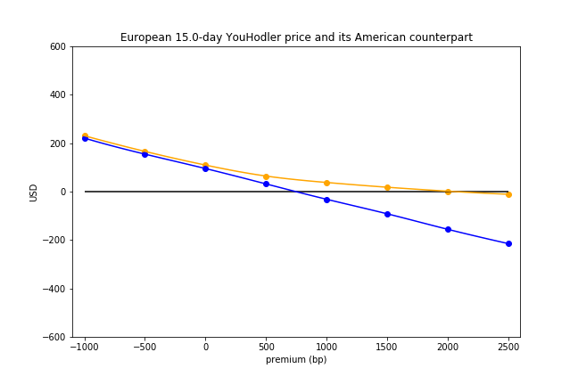
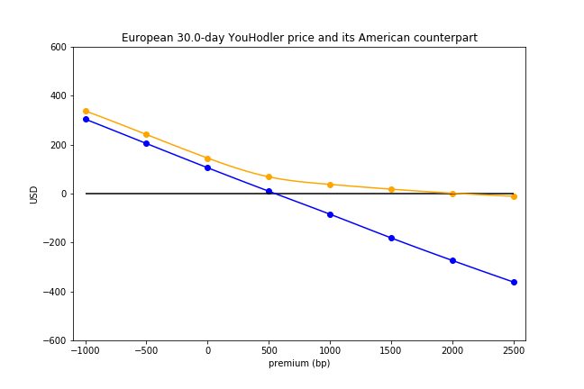
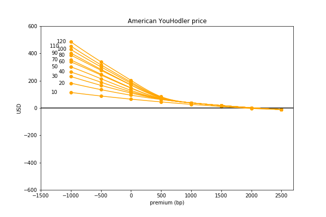
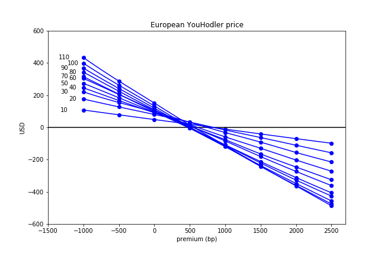
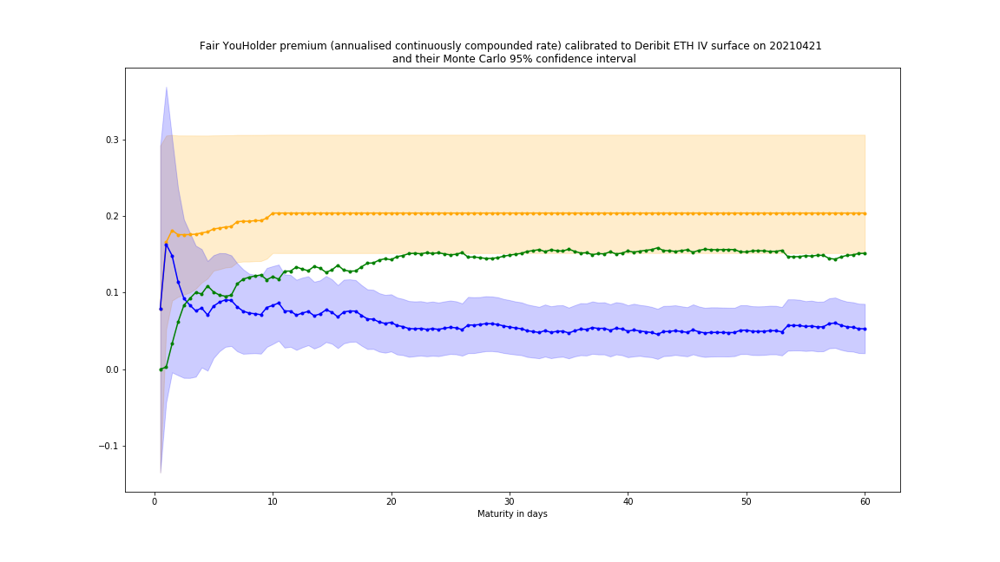

[](http://quantlet.de/)

## [](http://quantlet.de/) **IV_implied_fair_premium_curves** [](http://quantlet.de/)

```yaml

Name of Quantlet : IV_implied_fair_premium_curves

Description : Plot fair premium curves 

Keywords : p2p, p2p lending, no arbitrage, borrowing rate, IV surfaces, yield curves

Author : Francis Liu

Submitted : 2022/10/05

```













### [IPYNB Code: IV_implied_fair_premium_curves.ipynb](IV_implied_fair_premium_curves.ipynb)


automatically created on 2022-10-13